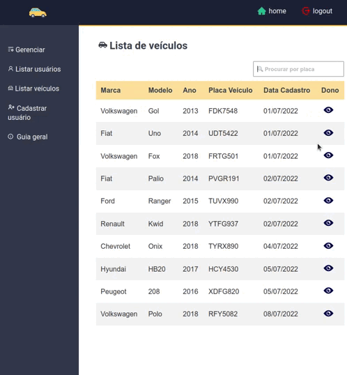
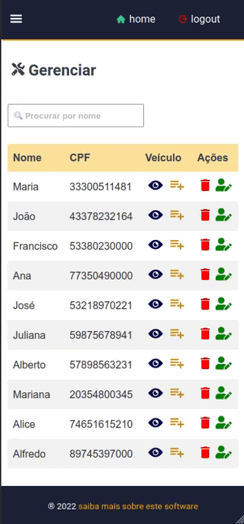

# parking-up

Este aplicativo se trata de um sistema de gestão para estacionamentos e foi desenvolvido para o primeiro desafio do StationOne.

Você pode acessar em [https://parkingup.vercel.app](https://parkingup.vercel.app)

Para informações sobre a API, consulte a [documentação](https://parkingup.herokuapp.com/docs).

Tecnologias utilizadas neste projeto:

- react.js
- node.js
- mongoDB
- axios (http client)
- react-modal
- react-router-dom
- react-icons
- events
- date-fns 
- express.js
- mongoose
- nodemon
- swaggger-ui-express
- cors

## Schemas do banco de dados


   Usuarios                 |      Veiculos 
----------------------------|----------------------------
   nome: string             |      marca: string
   email: string            |      modelo: string
   cpf: string              |      ano: string
   dataNascimento: string   |      placaVeiculo: string
   veiculos: array          |      dono: string
   

## Demonstração

#### Validação dos campos e mensagens de aviso


#### Página de gerenciamento


#### Lista de veículos


#### Modal exibindo veículos


#### Barra de pesquisa


#### Sidebar versão mobile


### Instruções para rodar o app localmente

#### Front-end

1. Navegue até o diretório frontend

2. Instale as dependências do projeto:
```bash
npm install
```
3. Execute aplicação:
```bash
npm run dev
```

